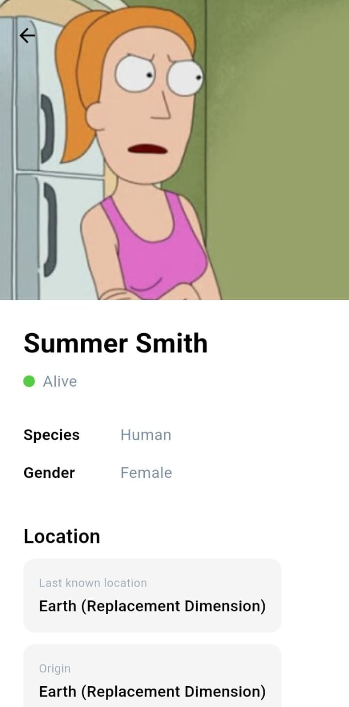
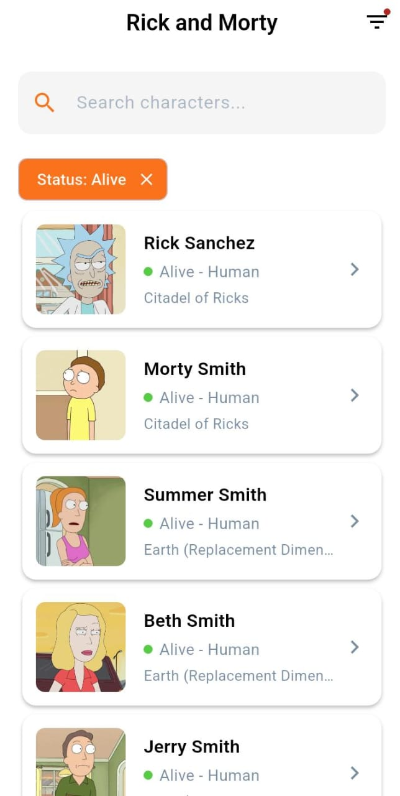
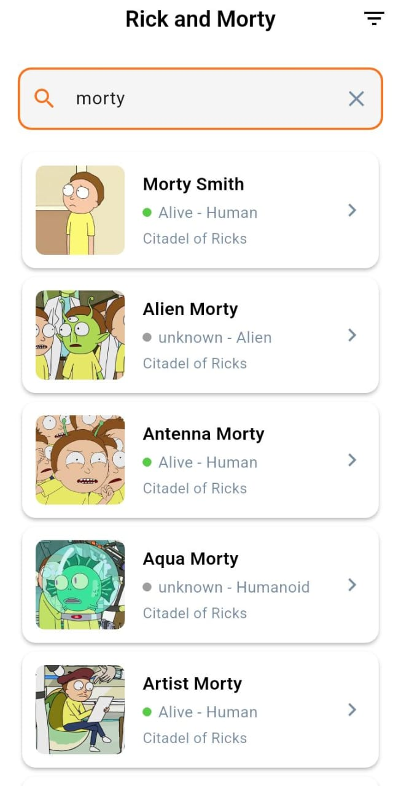

# Rick and Morty Character App

A Flutter application that displays characters from the Rick and Morty universe using the Rick and Morty API. Built with clean architecture and BLoC pattern for state management.

## Screenshots

### Home Screen

### Charcter Detail Screen

### Filter Character Screen

### Search Charcter Screen

## Features

- Browse characters from Rick and Morty
- Search characters by name with debounced input
- View detailed character information
- Pull-to-refresh functionality
- Smooth hero animations between screens
- Error handling with retry functionality
- Loading states with shimmer effects
- Empty state handling

## Technology Stack

- Framework: Flutter
- State Management: BLoC (flutter_bloc)
- Architecture: Clean Architecture (Domain, Data, Presentation layers)
- API: Rick and Morty API
- Dependencies:
  - `flutter_bloc` - State management
  - `equatable` - Value equality
  - `http` - HTTP requests
  - `cached_network_image` - Image caching
  - `shimmer` - Loading animations
  - `dartz` - Functional programming

## Project Structure

lib/
├── core/
│ ├── constants/
│ ├── theme/
│ └── utils/
├── data/
│ ├── models/
│ ├── repositories/
│ └── datasources/
├── domain/
│ ├── entities/
│ └── repositories/
└── presentation/
├── bloc/
├── pages/
└── widgets/

## Getting Started

### Prerequisites

- Flutter SDK (>=3.0.0)
- Dart SDK (>=3.0.0)
- Android Studio / VS Code
- Android SDK / Xcode (for iOS)

### Installation

1. Clone the repository:

git clone https://github.com/Lovelyn-Flutter/rick_morty_app.git
cd rick_morty_app

2. Install dependencies:

flutter pub get

3. Run the app:

flutter run

## API Reference

This app uses the Rick and Morty API: https://rickandmortyapi.com/

- Base URL: `https://rickandmortyapi.com/api`
- Character Endpoint: `/character`
- Search: `/character?name={query}`

## Architecture

The app follows Clean Architecture principles with three main layers:

1. Presentation Layer: UI components, BLoC for state management
2. Domain Layer: Business logic, entities, repository interfaces
3. Data Layer: API implementation, models, repository implementations

## Design Decisions

- BLoC Pattern: For predictable state management and separation of concerns
- Clean Architecture: For maintainability and testability
- Repository Pattern: Abstract data sources for easier testing and flexibility
- Hero Animations: Smooth transitions for better UX
- Shimmer Loading: Professional loading states
- Search Debouncing: Optimize API calls during search

## Brand Colors

The application color palette was derived from the company’s official website (https://www.virtualswitch.org/) to maintain brand consistency and visual familiarity. Primary colors were reused to reinforce identity, while neutral tones were applied for background elements to maintain readability and visual balance.

- Primary (Buttons): RGB(250, 114, 27)
- Text: RGB(120, 134, 162)
- Background: White
- Status Colors: Green (Alive), Red (Dead), Gray (Unknown)

## License

This project is created for educational purposes.
